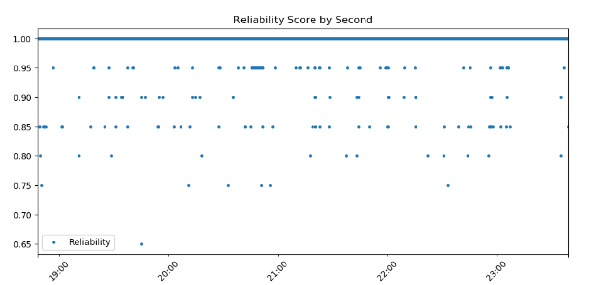
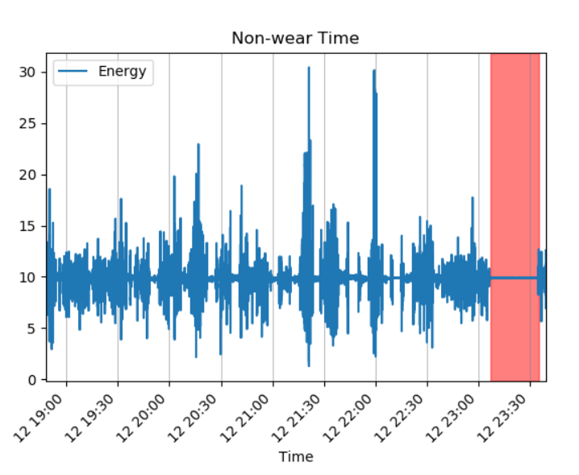

# Smart Watch Processing
A project to demonstrate coding knowledge and use of data analysis and visualization techniques.  

A tool to process data from a wrist worn wearable device.
-  The software generates a full data set for sample 6 hour long (1 hour segmented) csv files
- Reports reliability score for each 1 second epoch as well as full data set
- Calculate wear time vs non-wear time
- Visualization of data

# Initial running of python scripts

The tool is used to extract meaningful data about accelerometer data.

## Installation
Dependencies include: 
- [Python 3](https://www.python.org/downloads/) (3.7.4 used)
- - Python dependencies:
    - Pandas
    - Numpy
    - Matplotlib

## Usage

Clone the Repo
> $ git clone https://github.com/ttruty/SmartWatchProcessing.git

Sample data is has been added to the repo and can be tested with the commands from the terminal, powershell, or other cli tool.
Running software shows the plot with matplotlib allowing for zoom and pan.

Sample data located at [acc_data.csv](acc_data.csv), was processed to combine data from each hour long segment into full measure period. This can be accomplished on data using [ConcatData](ConcatData.py).

Example:
### Reliability
```
 $ python .\ReliabilityScore.py acc_data.csv
 ```
 Produces:
 > $ Reliability for data set = 0.9988838008013737

 > 

### Energy Calculation and Wear Time
```
 $ python .\EnergyCalculation.py acc_data.csv
 ```
 Produces:

Capture Segment Periods:

| block        | StartTime           | StopTime  | Non_Wear|
| ------------- |:-------------:| -----:|-----:|
| 1     | 2019-11-12 18:48:06.338 | 2019-11-12 23:06:41.912 | False
| 2     | 2019-11-12 23:06:41.933      |   2019-11-12 23:34:55.143 | True
| 3 | 2019-11-12 23:34:55.193      |    2019-11-12 23:34:55.143 | False

 > 

## Under the Hood

### Reliability

- Reliability score ([ReliabilityScore](ReliabilityScore.py)): Calculated for 1 second epochs as well as for full measurement time period.
- Plot is of reliability of 1 seconds epochs

### Energy calculation and wear time measures
- [EnergyCalculation](EnergyCalculation.py)
- Data is smoothed using a moving average.
- Initial non-wear time calculations were to be completed using using threshold with vector magnitude.
- This energy measure = square root of the sum of squares of each accelerometer axis.
- Energy measure is blue signal on plot.
- A most robust method to calculate non-wear time was applied using standard deviations of each axis.
- If 2 of the 3 axes STD was below 13 mg for at least 5 minutes it is labeled as "non-wear time" <sup>[1] [2]</sup>
- This is using a 5 minute time window
- Non-wear time is highlighted in red on plot.

## Future Work
- Allowing positional parameters with calling python scripts allows for automation of task, even creating a cron job to run daily to calculate non wear time.
- If data is streamed to server on a regular basis this algorithm could be combined with AWS Lambda and SNS services to alert the wearer via text message that "non-wear time is high and to please wear the device". 
- Non-wear algorithm can be expanded upon to see the most suitable STD for purpose, as some studies that used this method changed based on research populations. <sup>[3]</sup>


## References

[1]: Zhou S, Hill RA, Morgan K, et al Classification of accelerometer wear and non-wear events in seconds for monitoring free-living physical activity BMJ Open 2015;5:e007447. https://doi.org/10.1136/bmjopen-2014-007447

[2]: Inácio CM da Silva, Vincent T van Hees, Virgílio V Ramires, Alan G Knuth, Renata M Bielemann, Ulf Ekelund, Soren Brage, Pedro C Hallal, Physical activity levels in three Brazilian birth cohorts as assessed with raw triaxial wrist accelerometry, International Journal of Epidemiology, Volume 43, Issue 6, December 2014, Pages 1959–1968, https://doi.org/10.1093/ije/dyu203

[3]: van Hees VT, Renström F, Wright A, Gradmark A, Catt M, Chen KY, et al. (2011) Estimation of Daily Energy Expenditure in Pregnant and Non-Pregnant Women Using a Wrist-Worn Tri-Axial Accelerometer. PLoS ONE 6(7): e22922. https://doi.org/10.1371/journal.pone.0022922